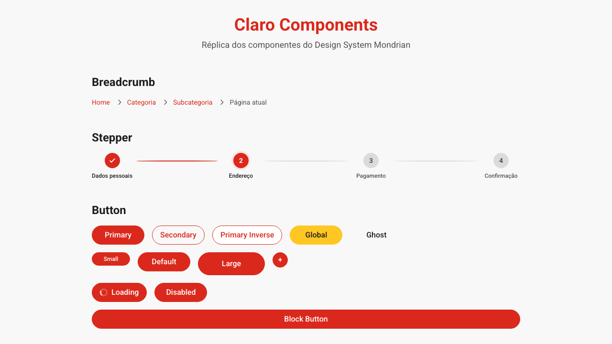

# Claro Design System

> Réplica fiel do **Design System Mondrian** da Claro Brasil — componentes de interface reconstruídos com React 19, Next.js 16 e Tailwind CSS v4.

<p align="center">
  
</p>

## Sobre

Este projeto é uma implementação open-source dos componentes de interface utilizados pela **Claro** em seus produtos digitais. O objetivo é reproduzir com precisão o visual, o comportamento e a experiência do Design System oficial, servindo como:

- **Referência de implementação** para desenvolvedores que trabalham com o design system da Claro
- **Showcase interativo** de todos os componentes em um único ambiente
- **Base de estudo** para design systems corporativos com identidade visual forte

## Stack

| Tecnologia | Versão | Uso |
|------------|--------|-----|
| [Next.js](https://nextjs.org) | 16.2.6 | Framework React com App Router |
| [React](https://react.dev) | 19.2.4 | Biblioteca de UI |
| [Tailwind CSS](https://tailwindcss.com) | v4 | Estilização utilitária |
| [TypeScript](https://www.typescriptlang.org) | 5 | Tipagem estática |
| [shadcn/ui](https://ui.shadcn.com) | 4.7.0 | Base para componentes acessíveis |
| [Base UI](https://base-ui.com) | 1.4.1 | Primitives de acessibilidade |
| [Lucide React](https://lucide.dev) | 1.14.0 | Ícones |

## Componentes

O projeto conta com **30+ componentes** organizados e documentados:

### Navegação & Estrutura
- **Breadcrumb** — Trilha de navegação hierárquica
- **Stepper** — Indicador de progresso em passos
- **Pagination** — Paginação de conteúdo
- **TabSelect** — Abas com conteúdo dinâmico
- **SkipLink** — Link de acessibilidade para pular navegação

### Ações
- **Button** — 7 variantes (primary, secondary, global, ghost, etc.) e 4 tamanhos
- **Link** — Links com variantes, externo e sublinhado
- **Toggle** — Interruptor on/off com acessibilidade

### Formulários
- **Input** — Campo de texto com label, helper, erro e estados
- **Checkbox** — Caixa de seleção com label e helper
- **Radio** — Botão de opção única
- **SpinBox** — Contador numérico com botões +/-

### Feedback
- **Alert** — Mensagens informativas (primary, success, danger, highlight)
- **ProgressBar** — Barra de progresso com porcentagem e cores
- **Spinner** — Indicador de carregamento em 3 tamanhos
- **Tooltip** — Dicas contextuais em 4 posições
- **Modal** — Diálogo com overlay, título, descrição e footer

### Conteúdo
- **Card** — Container com header, content e footer
- **Accordion** — Lista colapsável com múltiplos itens
- **Collapse** — Seção expansível individual
- **Tag** — Rótulos coloridos (6 variantes, 3 tamanhos)
- **Text / Heading** — Tipografia com variantes de estilo
- **Image** — Imagem com aspect ratio controlado
- **Price** — Exibição de preços (inteiro, centavos, período)
- **Rating** — Avaliação por estrelas com nota e quantidade

### Layout & Utilitários
- **Divider** — Divisor horizontal e vertical
- **Countdown** — Contagem regressiva com dias, horas, minutos e segundos
- **LinkList** — Lista de links com título
- **Topic** — Bloco de destaque com ícone, título, descrição e ação
- **Footer** — Rodapé institucional

## Paleta de Cores

O design system utiliza as cores oficiais da marca Claro, organizadas em tokens CSS:

```css
/* Primária */
--color-brand-primary-medium   /* Roxo Claro */
--color-brand-primary-dark

/* Secundária */
--color-brand-secondary-medium /* Magenta */
--color-brand-secondary-darkest

/* Neutros */
--color-neutral-light
--color-neutral-medium
--color-neutral-dark
--color-neutral-darkest

/* Destaques & Feedback */
--color-support-success-dark   /* Verde */
--color-support-highlight-medium /* Amarelo */
```

## Como usar

### 1. Clone o repositório

```bash
git clone https://github.com/loadrp/claro-design-system.git
cd claro-design-system
```

### 2. Instale as dependências

```bash
npm install
```

### 3. Inicie o servidor de desenvolvimento

```bash
npm run dev
```

Abra [http://localhost:3000](http://localhost:3000) no navegador para visualizar o showcase de todos os componentes.

### 4. Build de produção

```bash
npm run build
```

## Estrutura do Projeto

```
my-app/
├── src/
│   ├── app/                  # Rotas e layout (Next.js App Router)
│   │   ├── page.tsx          # Página principal com showcase
│   │   ├── layout.tsx        # Layout raiz
│   │   ├── globals.css       # Estilos globais
│   │   └── claro-tokens.css  # Tokens de design system
│   ├── components/
│   │   ├── claro/            # Componentes do Design System
│   │   │   ├── button.tsx
│   │   │   ├── input.tsx
│   │   │   ├── card.tsx
│   │   │   └── ... (30+ componentes)
│   │   └── ui/               # Componentes base do shadcn
│   └── lib/
│       └── utils.ts          # Utilitários (cn, etc.)
├── public/                   # Assets públicos
├── dist/                     # Build estático
└── references/               # Referências de stories originais
```

## Exemplo de uso

```tsx
import {
  ClaroButton,
  ClaroInput,
  ClaroCard,
  ClaroTag,
  ClaroAlert,
} from "@/components/claro";

export default function Page() {
  return (
    <ClaroCard>
      <ClaroTag variant="primary">Novo</ClaroTag>
      <h2>Plano Claro Pós</h2>
      <ClaroInput label="Seu nome" placeholder="Digite aqui..." />
      <ClaroButton variant="primary">Assinar agora</ClaroButton>
      <ClaroAlert variant="success">
        Cadastro realizado com sucesso!
      </ClaroAlert>
    </ClaroCard>
  );
}
```

## Princípios de Design

- **Acessibilidade** — Todos os componentes seguem padrões ARIA (roles, states, keyboard navigation)
- **Consistência Visual** — Tokens CSS centralizados garantem uniformidade
- **Composição** — Componentes são flexíveis e combináveis
- **Responsividade** — Layouts adaptáveis com Tailwind CSS
- **Performance** — Next.js 16 com React 19 e otimizações de build

## Acessibilidade

- Navegação completa via teclado
- Estados `focus-visible` com ring visual
- Labels associadas corretamente a inputs
- Atributos ARIA em componentes interativos (progressbar, modal, accordion)
- SkipLink para pular navegação repetitiva

## Referências

- [Design System Mondrian — Claro](https://www.claro.com.br)
- [shadcn/ui](https://ui.shadcn.com)
- [Base UI](https://base-ui.com)
- [Tailwind CSS v4](https://tailwindcss.com/docs/v4-beta)

## Licença

Este projeto é um trabalho independente de estudo e referência. A marca **Claro** e seu Design System Mondrian são propriedade da Claro Brasil. O código-fonte dos componentes está disponível para fins educacionais e de pesquisa.

---

<p align="center">
  Feito com 💜 para a comunidade de desenvolvimento
</p>
